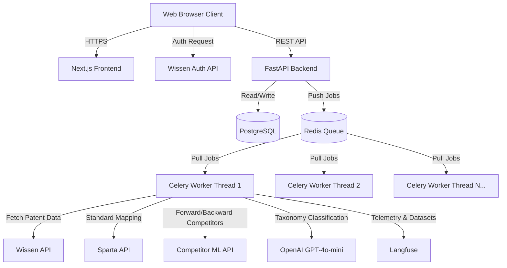

# System Architecture

This document provides a high-level overview of the Patent Portfolio Analysis platform's architecture. The system is designed to be highly scalable, asynchronous, and capable of processing large batches of patents concurrently while integrating with multiple external machine learning and data APIs.

## High-Level Architecture Diagram

## Technology Stack

### 1. Frontend Layer
- **Framework**: Next.js 15 (React)
- **Styling**: Tailwind CSS with custom Glassmorphism aesthetics
- **Role**: Provides a responsive, dynamic UI for users to upload patent Excel batches, monitor live progress, and view enriched portfolio data.

### 2. API Backend Layer
- **Framework**: FastAPI (Python 3.12)
- **Server**: Uvicorn
- **Role**: Handles REST API requests, validates inputs, manages session states, and enqueues processing tasks.

### 3. Asynchronous Worker Layer
- **Framework**: Celery
- **Concurrency**: Thread-pool based processing (`--pool=threads`)
- **Role**: Consumes background tasks from the queue. Each task handles the entire pipeline for a single patent, ensuring failure isolation and horizontal scalability.

### 4. Data Storage & Message Broker
- **Primary Database**: PostgreSQL (Stores users, sessions, and processed patent metadata)
- **Message Broker**: Redis (Handles task queue routing and active session tracking for round-robin dispatch)
- **ORM**: SQLAlchemy

### 5. Third-Party Integrations
- **Wissen API**: Primary source of truth for patent abstract, claims, and citations.
- **OpenAI (GPT-4o-mini)**: Generative AI for extracting hierarchical technical taxonomies.
- **Sparta API**: Maps patents to known telecommunication or technology standards.
- **Competitor ML API**: External machine learning microservice that analyzes forward and backward citation assignees to identify key market competitors.
- **Langfuse**: LLM Observability platform used for tracing OpenAI calls, monitoring token costs, and curating evaluation datasets in the background.

## Design Patterns

1. **Round-Robin Fair Scheduling**: To ensure that a user uploading 10,000 patents does not block a user uploading 5 patents, the backend utilizes a custom round-robin Celery dispatcher.
2. **Idempotent Tasks**: Every Celery task can safely be retried without duplicating data. If a patent fails halfway, the retry will skip completed steps.
3. **Graceful Degradation**: External APIs are wrapped in circuit breakers and exponential backoffs. If the Competitor API fails, the pipeline still completes and returns the remaining enriched data rather than failing the entire patent.
